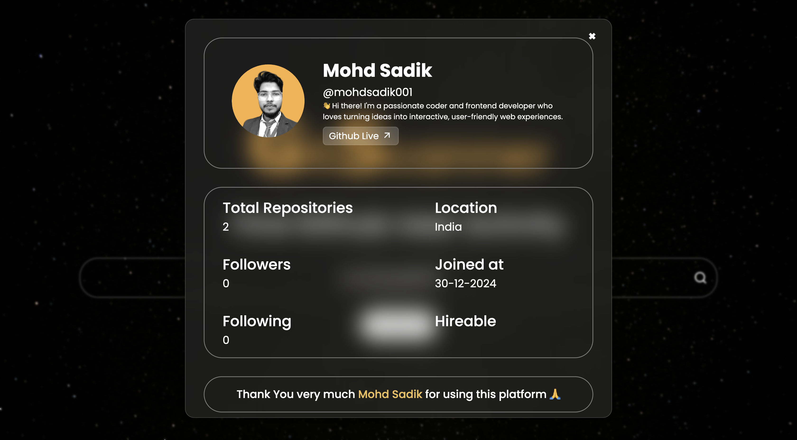

# 🔍 GitScanner

  
A sleek and responsive GitHub user activity scanner that fetches public profile details using the GitHub API.

---

## 🚀 Live Preview

🌐 [Check it out now](#) *(Add your deployment link here)*

---

## 📸 Screenshots

| Home Form | User Profile Popup |
|-----------|---------------------|
|  |  |

---

## 🧠 Features

- 🔍 Search any GitHub username
- 📊 Displays profile info (bio, followers, location, etc.)
- 🖼 Avatar and profile link
- 📅 Account creation date
- 📦 Public repository count
- 🧑‍💼 Hireable status
- 📱 Fully responsive for all devices

---

## 🛠️ Tech Stack

- **HTML5**
- **CSS3**
- **JavaScript (Vanilla)**
- [GitHub REST API](https://docs.github.com/en/rest)
- [Remix Icon](https://remixicon.com/)
- Google Fonts – Poppins, Roboto

